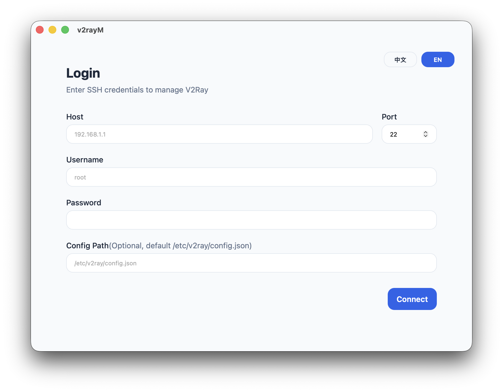
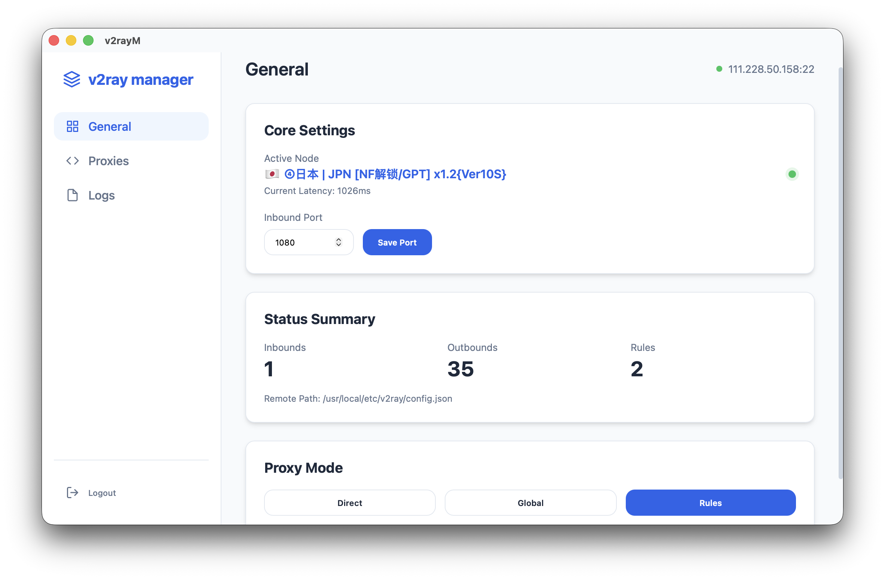

# v2rayM

[English](./README.md) | [简体中文](./README.zh-CN.md)

[](./LICENSE)
[](https://tauri.app/)
[](https://react.dev/)
[](https://www.rust-lang.org/)

A desktop control plane for managing V2Ray subscriptions and nodes on remote Linux servers.

## Overview

v2rayM is a local desktop application that connects to a remote Linux server already running [V2Ray Core](https://github.com/v2fly/v2ray-core). It provides a focused GUI for inspecting the active server configuration, importing subscription links, applying nodes, switching outbounds, and validating connectivity without repeatedly editing remote JSON files over SSH.

In practical terms, this project is built for people who already operate V2Ray on a server and want a faster, safer, and more visual way to manage it from their local machine.

## Why v2rayM Exists

Operating V2Ray on a remote host is usually a fragmented workflow:

- sign in to the server over SSH
- locate and edit the active V2Ray configuration manually
- synchronize subscription nodes
- switch the active outbound or routing behavior
- restart the service and verify that traffic is actually flowing

v2rayM consolidates that operational loop into a single desktop application. The goal is not to replace V2Ray itself, but to make day-to-day remote management significantly more efficient, predictable, and approachable.

## Product Preview

<table>
  <tr>
    <td align="center" width="50%">
      
      <br />
      <sub>Connect to a remote Linux server through a dedicated SSH login flow.</sub>
    </td>
    <td align="center" width="50%">
      
      <br />
      <sub>Review the active node, inspect core settings, and manage remote proxy behavior from one place.</sub>
    </td>
  </tr>
</table>

## What It Helps You Do

- connect to a remote Linux server over SSH from a local desktop app
- read and summarize the active V2Ray configuration
- import subscription URLs and parse `vmess`, `vless`, `trojan`, `ss`, and `ssr` nodes
- apply one or multiple nodes to the remote server configuration
- switch the active outbound through the GUI instead of manual config editing
- update the inbound listening port
- run remote connectivity and latency-related checks
- persist common connection details, subscription URL, and language preference locally
- work with built-in Chinese and English UI text

## Typical Workflow

1. Open the app locally and connect to the remote Linux server over SSH.
2. Load the current V2Ray configuration from the target server.
3. Import a subscription URL and parse the available nodes.
4. Apply nodes back to the server configuration or switch the active outbound.
5. Adjust the inbound port when required.
6. Run a connectivity test to confirm the proxy path is healthy.

## Intended Scope

v2rayM is intentionally scoped as a remote management client.

- It manages an existing V2Ray deployment.
- It does not install V2Ray for you.
- It assumes the target service is already deployed and can be managed through `systemctl restart v2ray`.
- By default, it reads the remote configuration from `/etc/v2ray/config.json`.

## Tech Stack

- Frontend: React 18 + TypeScript + Vite
- Desktop shell: Tauri v2
- Backend commands: Rust + Tokio + Reqwest + SSH2
- Testing: Vitest and Rust tests

## Requirements

Before running locally, make sure you have:

- Node.js 20+
- npm 10+
- Rust stable toolchain
- Tauri system dependencies for your operating system
- a reachable Linux server with SSH access
- a server that already has V2Ray installed and running
- a readable V2Ray configuration file on the target server

## Quick Start

### 1. Install dependencies

```bash
npm install
```

### 2. Start development mode

```bash
npm run tauri dev
```

### 3. Run tests

```bash
npm test
cargo test --manifest-path src-tauri/Cargo.toml
```

### 4. Build the desktop app

```bash
npm run tauri build
```

## Project Structure

```text
.
|-- screenshot/               # README screenshots and product preview assets
|-- src/                      # React UI, state, i18n, and utilities
|-- src-tauri/                # Rust commands, SSH client, parser, and config composer
|-- public/                   # Static assets
|-- .github/                  # GitHub issue and pull request templates
|-- README.md                 # English README
|-- README.zh-CN.md           # Chinese README
|-- CONTRIBUTING.md           # English contribution guide
|-- CONTRIBUTING.zh-CN.md     # Chinese contribution guide
|-- CODE_OF_CONDUCT.md        # English code of conduct
|-- CODE_OF_CONDUCT.zh-CN.md  # Chinese code of conduct
|-- SECURITY.md               # English security policy
|-- SECURITY.zh-CN.md         # Chinese security policy
|-- CHANGELOG.md              # English changelog
|-- CHANGELOG.zh-CN.md        # Chinese changelog
|-- LICENSE                   # MIT license (authoritative text)
|-- LICENSE.zh-CN.md          # Chinese reference translation of the MIT license
```

## Documentation

- English contribution guide: [CONTRIBUTING.md](./CONTRIBUTING.md)
- 中文贡献指南: [CONTRIBUTING.zh-CN.md](./CONTRIBUTING.zh-CN.md)
- English security policy: [SECURITY.md](./SECURITY.md)
- 中文安全说明: [SECURITY.zh-CN.md](./SECURITY.zh-CN.md)
- English code of conduct: [CODE_OF_CONDUCT.md](./CODE_OF_CONDUCT.md)
- 中文行为准则: [CODE_OF_CONDUCT.zh-CN.md](./CODE_OF_CONDUCT.zh-CN.md)

## License

This project is licensed under the MIT License. See [LICENSE](./LICENSE) for the authoritative license text and [LICENSE.zh-CN.md](./LICENSE.zh-CN.md) for a Chinese reference translation.
